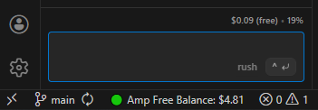
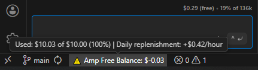

# Amp Free Balance - Quick Start

## What is this?

A VS Code extension that monitors your Amp API free tier balance and quota in real-time. Displays remaining balance in the status bar with color-coded indicators and optional low-balance warnings.

## Quick Install

1. Download latest `.vsix` from [Releases](https://github.com/ctenold/AmpFreeBalance/releases)
2. **Ctrl+Shift+P** → "Install from VSIX"
3. Select the file → Done ✅

## First Time Setup (6 Steps)

**The sidebar shows clear instructions, or follow these steps:**

### Step 1: Start Configuration
- Click the ⚠️ warning in the status bar, OR
- Press **Ctrl+Shift+P** → "Configure Session Token"

### Steps 2-6: Get Session Token
1. Browser opens → Go to **ampcode.com/settings**
2. Press **F12** to open DevTools
3. Click **Network** tab
4. Look for **"getFreeTierUsage"** request
5. Right-click → **"Copy as cURL"**
6. Paste the cURL command in the VS Code input box
7. ✅ Token auto-saved!

That's it. Your balance will display in the status bar.

## Status Bar Indicators

```
🟢 Green    = Usage < 70% (good)
🟡 Yellow   = Usage 70-89% (warning)
🔴 Red      = Usage ≥ 90% (critical)
⚠️ Warning  = Balance below threshold
```

**Hover over status bar** for detailed breakdown showing:
- Used and total quota in USD
- Usage percentage
- Hourly replenishment rate




## Settings

Open **Ctrl+,** and search `ampFreeBalance`:

- **accessToken** - Session token (auto-set, don't edit)
- **refreshInterval** - Check balance every N minutes (default: 5, set to 0 to disable)
- **lowBalanceThreshold** - Alert when balance drops below this USD amount (default: $1, set to 0 to disable)
- **apiUrl** - API endpoint (rarely needed, advanced only)

## Token Expires?

If you see "Authentication required" error:
1. Repeat the setup steps above (Step 1 → 6)
2. Get a fresh token from ampcode.com/settings
3. Paste it when prompted
4. Done!

## Troubleshooting

| Issue | Solution |
|-------|----------|
| Status bar shows warning | Run "Configure Session Token" command |
| Shows "Error" in sidebar | Token expired, get a fresh one |
| Can't find getFreeTierUsage request | Make sure you're on ampcode.com/settings page |
| Sidebar still says "Loading..." | Check console (View → Output) for error details |

## Commands

- **Configure Session Token** - Set up or refresh your authentication
- **Refresh Balance Data** - Manually check your balance (not normally needed)
- **Show Free Balance Status** - Focus the sidebar panel

All available via **Ctrl+Shift+P**

## Architecture

- `extension.js` - Main extension logic
- `package.json` - VS Code extension config
- `.github/workflows/publish.yml` - Auto-build and release workflow

## Development

Clone the repo and press **F5** to test in development mode.

Changes to `extension.js` or `package.json` require reload (**Ctrl+R**).

## Release Process

1. Update version in `package.json` (e.g., `1.3.0` → `1.3.1`)
2. Commit changes: `git add -A && git commit -m "v1.3.1: Description"`
3. Push to main: `git push origin main`
4. Create tag: `git tag v1.3.1 && git push origin v1.3.1`
5. GitHub Action automatically builds `.vsix` and creates release on GitHub

**Note:** The workflow in `.github/workflows/publish.yml` triggers on `v*` tags and auto-publishes to Releases tab.

## License

MIT - Free to use and modify for personal/commercial purposes.

---

**Questions?** Check the README.md or open an issue on GitHub.
